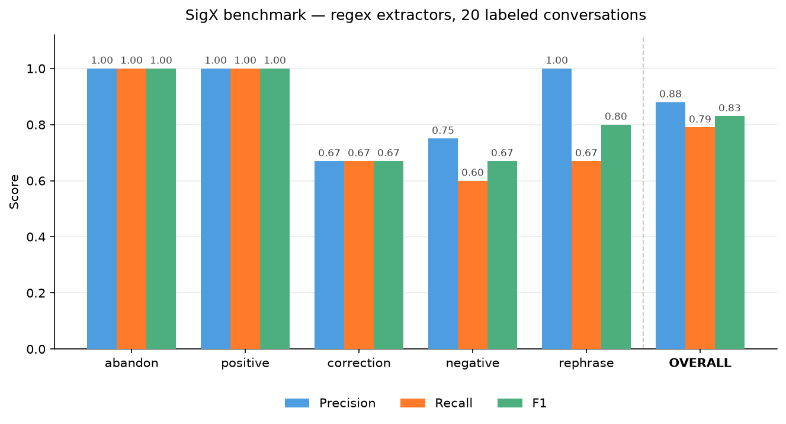

<div align="center">

[](https://github.com/Fengrru/sigx/actions/workflows/ci.yml)
[](https://codecov.io/gh/Fengrru/sigx)


# SigX

### Implicit Feedback Signal Extraction for LLM Alignment

**Extract preference signals from conversation logs — no human annotation required.**

[SigX Documentation](docs/index.md) | [Quick Start](#quick-start) | [API Reference](docs/api/pipeline.md) | [Contributing](CONTRIBUTING.md)

</div>

---

## Why SigX?

Traditional LLM alignment relies on **expensive human annotations** or **synthetic preferences from GPT-4**. But every production chat log already contains rich preference signals:

| What Users Do | What It Means | SigX Signal |
|:---|:---|:---|
| Re-ask the same question | Previous answer was unhelpful | `rephrase` |
| Say "Actually I meant..." | Model misunderstood | `correction` |
| Say "That's wrong" | Explicit dissatisfaction | `negative` |
| Say "Thanks! Perfect!" | Explicit satisfaction | `positive` |
| Say "Never mind" and leave | User gave up | `abandon` |

**SigX mines these signals at zero marginal cost** — turning your existing chat logs into DPO/KTO training data.

> Inspired by [WildFeedback](https://arxiv.org/abs/2408.15549) (Microsoft Research, 2024) and the broader literature on learning from implicit preferences.

---

## Comparison with Related Tools

| Feature | **SigX** | TRL (HuggingFace) | VeRL |
|:---|:---:|:---:|:---:|
| **Extract signals from raw logs** | **Yes** | No (expects labeled pairs) | No |
| **Implicit feedback detection** | **Yes** | No | No |
| **DPO/KTO output format** | **Yes** | Yes (training only) | Yes (training only) |
| **Auto-infer chosen responses** | **Yes** | No | No |
| **Pluggable extractors** | **Yes** | No | No |
| **Built-in evaluation metrics** | **Yes** | No | No |
| **Zero GPU required** | **Yes** | No | No |

> SigX is not a training framework — it sits **upstream** of TRL/VeRL, producing the preference data they consume.

---

## Highlights

<table>
<tr>
<td width="50%">

### Core Capabilities

- **Pluggable Extractors** — Mix regex, TF-IDF, ML, and LLM detectors
- **Smart DPO Conversion** — Auto-infer `chosen` from subsequent positive turns
- **Multi-Format Output** — DPO, KTO, rejection sampling for TRL/VeRL
- **Built-in Evaluation** — Per-type precision/recall/F1 against benchmarks

</td>
<td width="50%">

### Design Principles

- **Lightweight** — Only `numpy` + `scikit-learn`. No GPU needed.
- **Extensible** — Subclass `BaseExtractor` for custom detectors
- **Production-ready** — Type annotations, 92 tests, CI/CD
- **Framework-agnostic** — Output compatible with TRL, VeRL, and more

</td>
</tr>
</table>

---

## Quick Start

```bash
pip install git+https://github.com/Fengrru/sigx.git
```

### 1. Extract Signals from Conversations

```python
from sigx import Pipeline, RephraseDetector, SentimentDetector

pipeline = Pipeline([
    RephraseDetector(similarity_threshold=0.6),
    SentimentDetector(min_confidence=0.6),
])

conversations = [
    {
        "conversation_id": "1",
        "conversation": [
            {"role": "user", "content": "What is Python?"},
            {"role": "assistant", "content": "Python is a type of snake."},
            {"role": "user", "content": "That's not what I asked. I meant the programming language."},
            {"role": "assistant", "content": "Python is a high-level programming language created by Guido van Rossum."},
            {"role": "user", "content": "Thanks! That's exactly what I needed."},
        ]
    }
]

signals = pipeline.run(conversations)
for s in signals:
    print(f"[{s.signal_type}] confidence={s.confidence:.2f} | {s.evidence[:60]}...")
```

**Output:**
```
[negative] confidence=0.95 | That's not what I asked. I meant the programming language....
[positive] confidence=0.80 | Thanks! That's exactly what I needed....
```

### 2. Convert to DPO Training Pairs

```python
pairs = pipeline.to_dpo(conversations)
for p in pairs:
    print(f"Prompt:   {p.prompt[:80]}...")
    print(f"Rejected: {p.rejected[:80]}...")
    print(f"Chosen:   {p.chosen[:80] if p.chosen else 'None'}...")
```

**Output:**
```
Prompt:   User: What is Python?...
Rejected: Python is a type of snake....
Chosen:   Python is a high-level programming language created by Guido van Rossum....
```

### 3. Feed to TRL for Training

```python
from trl import DPOTrainer

trainer = DPOTrainer(
    model=model,
    train_dataset=pairs,  # SigX output works directly with TRL
)
trainer.train()
```

---

## Installation

> PyPI release coming soon. For now, install from source:

| Install Command | Includes |
|:---|:---|
| `pip install git+https://github.com/Fengrru/sigx.git` | Core (numpy, scikit-learn) |
| `pip install "sigx[llm] @ git+https://github.com/Fengrru/sigx.git"` | + OpenAI API for LLMExtractor |
| `pip install "sigx[wildchat] @ git+https://github.com/Fengrru/sigx.git"` | + HuggingFace datasets for WildChat |
| `git clone https://github.com/Fengrru/sigx.git && pip install -e ".[dev]"` | + pytest, ruff, mypy, pyright |

---

## Signal Types

SigX detects five categories of implicit feedback:

| Signal | Trigger Pattern | Confidence Range | Training Implication |
|:---|:---|:---:|:---|
| `rephrase` | User re-asks similar question (TF-IDF cosine sim) | 0.60 – 1.00 | Previous response → `rejected` |
| `correction` | "Actually I meant...", "No, that's not..." | 0.60 – 0.95 | Model output → `rejected` |
| `negative` | "That's wrong", "Not helpful" | 0.65 – 0.95 | Explicit dissatisfaction → `rejected` |
| `positive` | "Thanks!", "Exactly what I needed" | 0.60 – 0.90 | Explicit satisfaction → `chosen` / `label=True` |
| `abandon` | "Never mind", "I give up", trailing assistant | 0.35 – 0.90 | User gave up → `rejected` |

---

## Extractors

### RephraseDetector

Detects when users rephrase or repeat a question using TF-IDF cosine similarity.
For CJK text (Chinese/Japanese/Korean) it automatically switches to character
n-grams, since whitespace tokenization does not apply to those languages.

```python
from sigx import RephraseDetector

detector = RephraseDetector(
    similarity_threshold=0.6,   # Cosine similarity threshold
    min_turn_length=20,         # Skip user turns shorter than this (chars)
    skip_acknowledgments=True,  # Skip "thanks", "ok", etc.
)
```

### SentimentDetector

Hybrid regex + ML detection with 41 built-in patterns for corrections, negatives, positives, and sarcasm.

```python
from sigx import SentimentDetector

# Rule-only mode (default, no extra deps)
detector = SentimentDetector(min_confidence=0.6)

# ML-enhanced mode (broader coverage)
detector = SentimentDetector(use_ml=True, min_confidence=0.5)
detector.fit(
    texts=["that's wrong", "thanks!", "actually I meant..."],
    labels=["negative", "positive", "correction"],
)
```

### AbandonDetector

Detects when users give up via explicit patterns or conversation structure analysis.

```python
from sigx import AbandonDetector

detector = AbandonDetector(
    min_assistant_length=300,           # Min chars for trailing-assistant
    min_turns=3,                        # Min conversation length
    require_unanswered_question=True,   # Only flag if user asked a question
)
```

### LLMExtractor

High-accuracy classification using any OpenAI-compatible LLM.

```python
from sigx import LLMExtractor

detector = LLMExtractor(
    model="gpt-4o-mini",            # Or "qwen2.5-7b-instruct" via vLLM
    base_url=None,                  # Defaults to OpenAI; set for Ollama/vLLM
    api_key="sk-...",               # Or set OPENAI_API_KEY env var
    min_confidence=0.6,
)
```

### Custom Extractors

```python
from sigx.extractors import BaseExtractor
from sigx.types import Signal

class ToxicityExtractor(BaseExtractor):
    name = "toxicity"

    def extract(self, conversation: dict) -> list[Signal]:
        signals = []
        # Your detection logic here
        return signals

pipeline = Pipeline([ToxicityExtractor()])
```

---

## DPO Chosen Strategies

A key innovation: SigX automatically infers the `chosen` response from subsequent conversation turns.

| Strategy | Behavior | Use Case |
|:---|:---|:---|
| `subsequent` *(default)* | Find positive turn after negative signal; use assistant response before it as `chosen` | Best quality |
| `last_assistant` | Use the final assistant response as `chosen` | Simple fallback |
| `none` | `chosen=None` | Backward compatible |

```python
from sigx import Pipeline, CHOSEN_SUBSEQUENT, CHOSEN_NONE

# Default: smart chosen inference
pipeline = Pipeline(extractors=[...], chosen_strategy=CHOSEN_SUBSEQUENT)

# Backward compatible: no chosen inference
pipeline = Pipeline(extractors=[...], chosen_strategy=CHOSEN_NONE)
```

---

## Data Loading

SigX supports multiple conversation formats:

```python
from sigx import load_conversations, load_wildchat, stream_wildchat

# ShareGPT format
convos = load_conversations("sharegpt_data.json", format="sharegpt")

# OpenAI chat format
convos = load_conversations("openai_data.json", format="openai")

# Generic JSONL
convos = load_conversations("logs.jsonl", format="jsonl")

# WildChat from HuggingFace (1M+ conversations)
convos = load_wildchat(n=1000)

# Stream large datasets (memory efficient)
for convo in stream_wildchat(n=10000):
    signals = pipeline.run([convo])
```

---

## Output Formats

### DPO (Direct Preference Optimization)

```python
pairs = pipeline.to_dpo(conversations)
# List[PreferencePair] — compatible with TRL's DPOTrainer
```

### KTO (Kahneman-Tversky Optimization)

```python
examples = pipeline.to_kto(conversations)
# List[KTOExample] — binary labels: True (desirable), False (undesirable)
```

### Rejection Sampling

```python
pairs = pipeline.to_rejection(conversations)
# List[dict] with keys: prompt, rejected, signal_type, confidence
```

---

## End-to-End Training Pipeline

```mermaid
%%{init: {'theme': 'base', 'themeVariables': { 'primaryColor': '#e3f2fd', 'primaryTextColor': '#1565c0', 'primaryBorderColor': '#1565c0', 'lineColor': '#90a4ae', 'secondaryColor': '#fff3e0', 'tertiaryColor': '#e8f5e9'}}}%%

graph LR
    subgraph INPUT [" "]
        direction TB
        I1["JSONL"]
        I2["ShareGPT"]
        I3["WildChat"]
        I4["OpenAI"]
    end

    subgraph SIGX ["SigX"]
        direction LR
        S1["Extract"] --> S2["Filter"] --> S3["Convert"]
    end

    subgraph OUTPUT [" "]
        direction TB
        O1["DPO Pairs"]
        O2["KTO Examples"]
    end

    INPUT --> SIGX --> OUTPUT

    style INPUT fill:#e3f2fd,stroke:#1565c0,stroke-width:2px,color:#0d47a1
    style SIGX fill:#fff3e0,stroke:#e65100,stroke-width:2px,color:#bf360c
    style OUTPUT fill:#e8f5e9,stroke:#2e7d32,stroke-width:2px,color:#1b5e20
```



```python
from sigx import Pipeline, SentimentDetector, RephraseDetector, AbandonDetector
from sigx.io import load_wildchat

# 1. Configure pipeline
pipeline = Pipeline([
    SentimentDetector(min_confidence=0.6),
    RephraseDetector(similarity_threshold=0.6),
    AbandonDetector(min_turns=3),
])

# 2. Load conversation data
convos = load_wildchat(n=10000)

# 3. Convert to DPO training pairs
dpo_pairs = pipeline.to_dpo(convos)

# 4. Feed directly to TRL
from trl import DPOTrainer
trainer = DPOTrainer(model=model, train_dataset=dpo_pairs)
trainer.train()
```

---

## Evaluation

Evaluate extraction quality against a labeled benchmark:

```python
metrics = pipeline.evaluate("benchmark.json")

print(f"Overall F1: {metrics['overall']['f1']:.4f}")
# Per-type breakdown
for signal_type, m in metrics["per_type"].items():
    print(f"  {signal_type}: P={m['precision']:.4f} R={m['recall']:.4f} F1={m['f1']:.4f}")
```

### Benchmark Results

Evaluated on a 20-conversation benchmark with regex-based extractors (default settings, no LLM):



| Signal Type | Precision | Recall | F1 | Support |
|:---|:---:|:---:|:---:|:---:|
| abandon | 1.00 | 1.00 | **1.00** | 3 |
| positive | 1.00 | 1.00 | **1.00** | 5 |
| correction | 0.67 | 0.67 | **0.67** | 3 |
| negative | 0.75 | 0.60 | **0.67** | 5 |
| rephrase | 1.00 | 0.67 | **0.80** | 3 |
| **Overall** | **0.88** | **0.79** | **0.83** | 19 |

> Reproduce with `pipeline.evaluate("tests/benchmark.json")`; regenerate the chart with `python scripts/generate_assets.py`. Adding `LLMExtractor` significantly improves recall on `negative` and `rephrase` types.

---

## Architecture

```
sigx/
├── pipeline.py          # Orchestration: extract → filter → convert
├── types.py             # Core dataclasses: Signal, PreferencePair, KTOExample
├── exceptions.py        # Custom exception hierarchy
├── extractors/
│   ├── base.py          # Abstract BaseExtractor
│   ├── rephrase.py      # TF-IDF cosine similarity rephrase detection
│   ├── sentiment.py     # Regex + optional ML sentiment classifier
│   ├── abandon.py       # Frustration pattern + trailing-assistant detection
│   └── llm.py           # OpenAI-compatible LLM classifier
├── filters/
│   └── quality.py       # Confidence threshold, dedup, per-conv limits
├── converters/
│   └── preference.py    # DPO / KTO / rejection-sampling converters
└── io/
    └── loader.py        # ShareGPT, OpenAI, WildChat, JSONL loaders
```

---

## Research Background

SigX is built on growing evidence that **implicit feedback from real user interactions produces better alignment data** than synthetic alternatives:

| Paper | Institution | Year | Key Finding |
|:---|:---|:---:|:---|
| [WildFeedback](https://arxiv.org/abs/2408.15549) | Microsoft Research | 2024 | 20K preference pairs from 148K ChatGPT conversations outperformed UltraFeedback on AlpacaEval 2, Arena-Hard, MT-Bench |

**The key insight**: Real user feedback captures nuance that synthetic data misses, and the signals are already present in existing chat logs — they just need to be extracted.

### How SigX Relates

| Project | Focus | SigX Connection |
|:---|:---|:---|
| [WildFeedback](https://arxiv.org/abs/2408.15549) | Extracting preference pairs from in-situ feedback | SigX implements the extraction pipeline in Python |
| [TRL](https://github.com/huggingface/trl) | Post-training (DPO/KTO/PPO) | SigX output is TRL-compatible |
| [VeRL](https://github.com/volcengine/verl) | RLHF framework | SigX output works with VeRL |

---

## Development

```bash
git clone https://github.com/fengrru/sigx.git
cd sigx
pip install -e ".[dev]"

# Run tests
pytest                    # 92 tests
pytest --cov=sigx         # With coverage

# Lint
ruff check .              # Lint
ruff format .             # Format

# Type check
mypy sigx/                # mypy
pyright                   # pyright
```

---

## Citation

```bibtex
@software{sigx2026,
  title   = {{SigX: Implicit Feedback Signal Extraction for LLM Alignment}},
  author  = {fengrru},
  license = {MIT},
  url     = {https://github.com/fengrru/sigx},
  year    = {2026},
}
```

---

## License

MIT License — see [LICENSE](LICENSE) for details.

---

<div align="center">

**Built with care for the LLM alignment community.**

[Report Bug](https://github.com/fengrru/sigx/issues) · [Request Feature](https://github.com/fengrru/sigx/issues) · [Contributing Guide](CONTRIBUTING.md)

</div>
